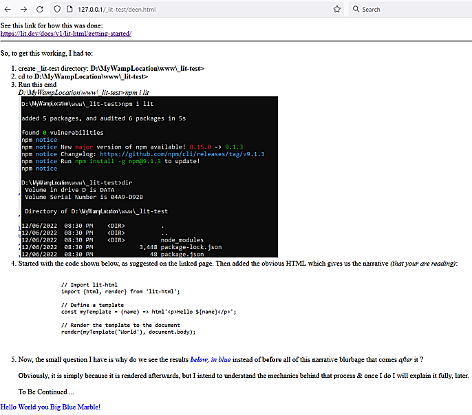

# Google-Lit.dev-on-WAMP

Read the source in deen.html to see exactly how this was installed on a typical WAMP setup on Windows 10 PC.

The code in <b>deen.html</B> yields the screen seen below in a Firefox browser:

